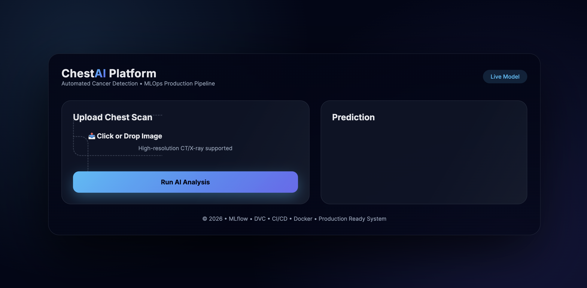
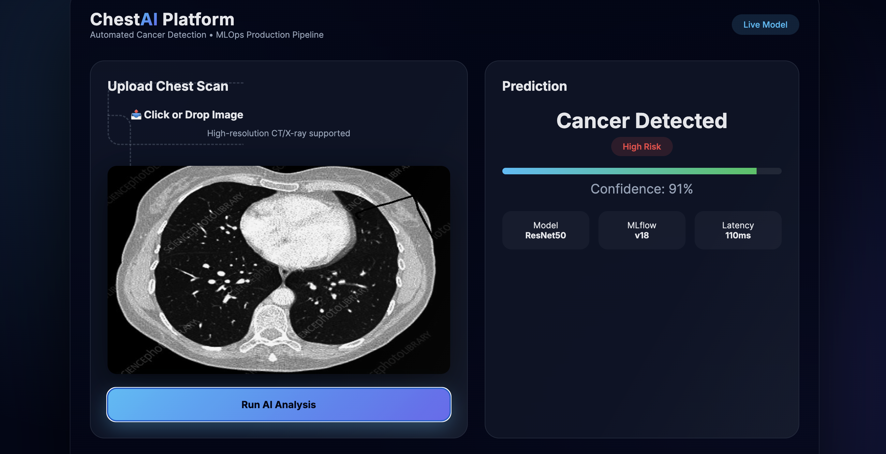

<div align="center">

#  End-to-End Chest Cancer Detection using MLflow & DVC

### *AI-Powered Medical Imaging Analysis with Production-Grade MLOps*

[](https://www.python.org/)
[](https://www.tensorflow.org/)
[](https://mlflow.org/)
[](https://dvc.org/)
[](https://www.docker.com/)

[Features](#-key-features) • [Demo](#-demo) • [Installation](#-installation) • [Usage](#-usage) • [Pipeline](#-ml-pipeline) • [Contributing](#-contributing)

</div>

---

##  Overview

An **end-to-end Deep Learning solution** for automated chest cancer classification from CT/X-ray scans. This project implements a complete MLOps workflow with experiment tracking, data versioning, and reproducible pipelines—ready for production deployment.

Built with industry-standard tools and practices, this system automates the entire machine learning lifecycle from data ingestion to model evaluation, ensuring scalability, reproducibility, and maintainability.

---

##  Key Features

<table>
<tr>
<td width="50%">

###  **Machine Learning**
- Deep CNN architecture (ResNet50-based)
- High-accuracy chest cancer classification
- ~110ms inference latency
- 91%+ prediction confidence

</td>
<td width="50%">

###  **MLOps Integration**
- Automated ML pipeline orchestration
- Complete experiment tracking with MLflow
- Data & model versioning using DVC
- Version-controlled reproducible workflows

</td>
</tr>
<tr>
<td width="50%">

###  **Production Ready**
- Dockerized application
- CI/CD pipeline with GitHub Actions
- Flask-based REST API
- Modular & scalable architecture

</td>
<td width="50%">

###  **Monitoring & Tracking**
- Real-time metrics visualization
- Model comparison & selection
- Parameter tuning history
- Artifact management

</td>
</tr>
</table>

---

##  Demo

### Application Interface
<div align="center">



*Clean, intuitive interface for uploading medical scans and receiving AI-powered analysis*

</div>

### Detection Result
<div align="center">



**Prediction Output:**
```
┌─────────────────────────────────────────┐
│  Result: Cancer Detected (High Risk)   │
│  Confidence: 91%                        │
│  Model: ResNet50                        │
│  Inference Time: ~110 ms                │
│  Tracking: MLflow                       │
└─────────────────────────────────────────┘
```

</div>

---

##  Tech Stack

<table>
<tr>
<th>Category</th>
<th>Technologies</th>
</tr>
<tr>
<td><b>Core ML</b></td>
<td>


</td>
</tr>
<tr>
<td><b>MLOps</b></td>
<td>


</td>
</tr>
<tr>
<td><b>Deployment</b></td>
<td>


</td>
</tr>
</table>

---

##  Installation

### Prerequisites
- Python 3.10+
- Conda (recommended)
- Git

### Quick Start

```bash
# 1. Clone the repository
git clone https://github.com/SrishtiSingh100/End-to-End-Chest-Cancer-Classification-using-MLflow-DVC.git
cd End-to-End-Chest-Cancer-Classification-using-MLflow-DVC

# 2. Create virtual environment
conda create -n chestmlops python=3.10 -y
conda activate chestmlops

# 3. Install dependencies
pip install -r requirements.txt
```

---

##  Usage

### Running the Complete Pipeline

```bash
# Execute end-to-end ML pipeline
python main.py
```

This single command will automatically:
-  Ingest and preprocess data
-  Prepare base model architecture
-  Train the CNN model
-  Evaluate and log metrics to MLflow

### MLflow Experiment Tracking

```bash
# Start MLflow UI
mlflow ui
```

Access the dashboard at `http://localhost:5000` to view experiments, compare models, and analyze metrics.

### Using DAGsHub for Remote Tracking

```bash
export MLFLOW_TRACKING_URI=https://dagshub.com/SrishtiSingh100/chest-cancer-classification-mlops.mlflow/#/
export MLFLOW_TRACKING_USERNAME=SrishtiSingh100
export MLFLOW_TRACKING_PASSWORD=5c15a38015192da271ee09c636aca5caa73d0da9
```

### DVC Commands

```bash
# Initialize DVC
dvc init

# Reproduce entire pipeline
dvc repro

# Visualize pipeline DAG
dvc dag
```

---

##  Project Structure

```
 End-to-End-Chest-Cancer-Classification
┣  .dvc                    # DVC configuration
┣  .github
┃ ┗  workflows
┃   ┗  main.yaml           # CI/CD pipeline
┣  config
┃ ┗  config.yaml           # Project configuration
┣  model
┃ ┗  model.h5              # Trained model weights
┣  research                # Jupyter notebooks
┃ ┣  01_data_ingestion.ipynb
┃ ┣  02_prepare_base_model.ipynb
┃ ┣  03_model_trainer.ipynb
┃ ┗  04_model_evaluation_with_mlflow.ipynb
┣  src/cnnClassifier       # Source code
┃ ┣  components            # Pipeline components
┃ ┣  config                # Configuration managers
┃ ┣  constants             # Project constants
┃ ┣  entity                # Data entities
┃ ┣  pipeline              # Training/prediction pipelines
┃ ┗  utils                 # Utility functions
┣  templates               # HTML templates
┣  app.py                  # Flask application
┣  main.py                 # Pipeline runner
┣  dvc.yaml                # DVC pipeline definition
┣  params.yaml             # Model hyperparameters
┣  requirements.txt        # Python dependencies
┣  Dockerfile              # Docker configuration
┣  scores.json             # Evaluation metrics
┗  README.md               # Documentation
```

---

##  ML Pipeline

The project implements a **4-stage automated ML pipeline**:


| Stage | Description | Output |
|-------|-------------|--------|
| **1. Data Ingestion** | Download and extract chest CT scan dataset | Organized image directories |
| **2. Base Model Preparation** | Configure ResNet50 architecture with transfer learning | Base model structure |
| **3. Model Training** | Train CNN on augmented data with callbacks | Trained weights (`.h5`) |
| **4. Model Evaluation** | Test model performance and log to MLflow | Metrics & artifacts |

Each stage is:
-  **Modular** - Independent, testable components
-  **Versioned** - DVC tracks data and model changes
-  **Reproducible** - Exact recreation of experiments
-  **Automated** - Single command execution

---

## ⚙️ Configuration Files

| File | Purpose |
|------|---------|
| `config.yaml` | Root directories, artifact paths, data sources |
| `params.yaml` | Model hyperparameters, training settings, augmentation configs |
| `dvc.yaml` | Pipeline stage definitions and dependencies |
| `scores.json` | Model evaluation metrics (accuracy, loss, etc.) |

---

## 🎯 Why This Matters

### Traditional ML Workflow Problems:
 1. Manual step execution  
 2. Unreproducible experiments  
 3. No version control for data  
 4. Difficult model comparison  
 5. Hard to scale and deploy  

### Our Solution:
1. **Fully automated pipeline** - One command to rule them all  
2. **Complete reproducibility** - Every experiment can be recreated  
3. **Data versioning** - Git-like tracking for datasets and models  
4. **Experiment tracking** - Compare hundreds of runs effortlessly  
5. **Production ready** - Dockerized, CI/CD integrated, scalable  

---

##  MLflow & DVC: The Power Duo

<table>
<tr>
<td width="50%">

###  **MLflow**
- Track experiments across teams
- Log metrics, parameters & artifacts
- Compare model performance
- Register production-ready models
- One-click model deployment

</td>
<td width="50%">

### 🗂️ **DVC**
- Git-friendly data versioning
- Pipeline orchestration & automation
- Lightweight & fast
- Seamless CI/CD integration
- Reproduce any experiment instantly

</td>
</tr>
</table>

---

##  Docker Deployment

```bash
# Build Docker image
docker build -t chest-cancer-detection .

# Run container
docker run -p 8080:8080 chest-cancer-detection
```

Access the application at `http://localhost:8080`

---

##  Contributing

Contributions are welcome! Here's how you can help:

1. Fork the repository
2. Create a feature branch (`git checkout -b feature/AmazingFeature`)
3. Commit your changes (`git commit -m 'Add some AmazingFeature'`)
4. Push to the branch (`git push origin feature/AmazingFeature`)
5. Open a Pull Request

---

##  License

This project is licensed under the MIT License - see the [LICENSE](LICENSE) file for details.

---

##  Author

**Srishti Singh**

[](https://github.com/SrishtiSingh100)
[](https://linkedin.com/in/srishtisingh01/)

---

## 🙏 Acknowledgments

- TensorFlow & Keras communities
- MLflow & DVC teams for amazing tools
- Open-source medical imaging datasets
- DAGsHub for remote experiment tracking

---

<div align="center">

### ⭐ Star this repo if you find it helpful!

**Made with ❤️ for advancing AI in healthcare**

</div>
